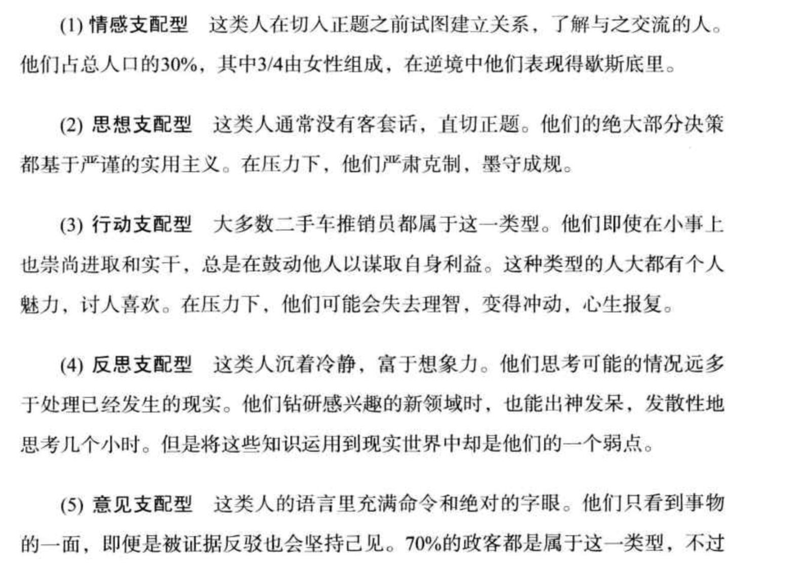
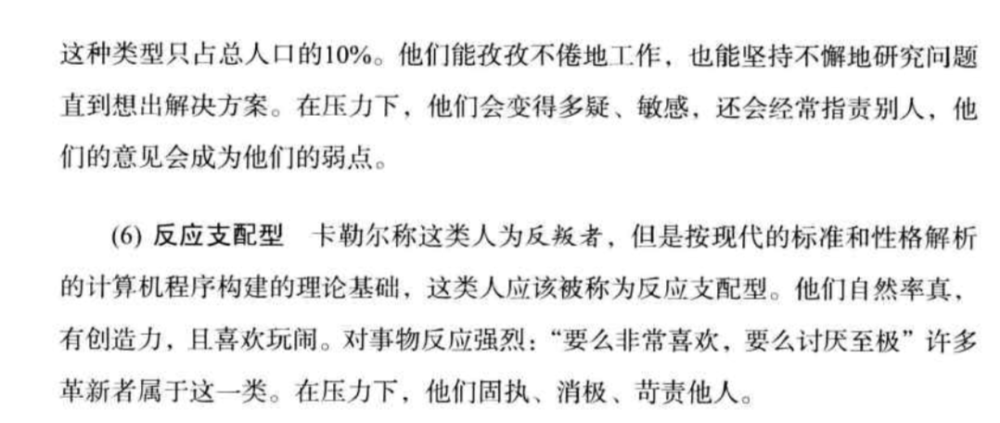

算法帝国

破坏的可能性和破坏产生的回报决定了算法改变的领域。

金钱、速度与科技总是携手并肩。

扑克：刀光火影间的虚张声势和电闪雷鸣般的快速分析。

博弈论预测个人利益（人总是会做他认为最符合自己利益的事）。人类是非理性动物。

华尔街硬件竞争

交易算法比拼

德州扑克博弈

政治决策，分析出怎样做才符合掌权人的最佳利益

算法匹配交友

总体来说，算法辅助人类，问题不大，但大体操控，容易引发争议，但华尔街交易算法的广泛使用，说明并不是凡事都要向人们解释得那么清楚。

终结一段关系的问题只能在两人相处过程中暴露。

人们在压力下如何交流，如何携手解决难题更能说明一段关系是否长久。

改变是糟糕的，不改变是好的。

## chp07 人的分类

有时压力不能击垮一个人，但是压力再加上与同伴的摩擦却可能产生严重的后果。

使用聚类算法按照人的性格分类。辅助追女孩….

 

## chp08 华尔街与硅谷
